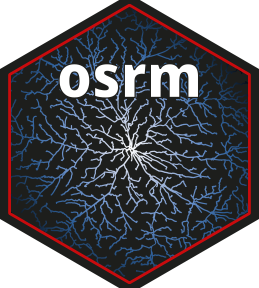
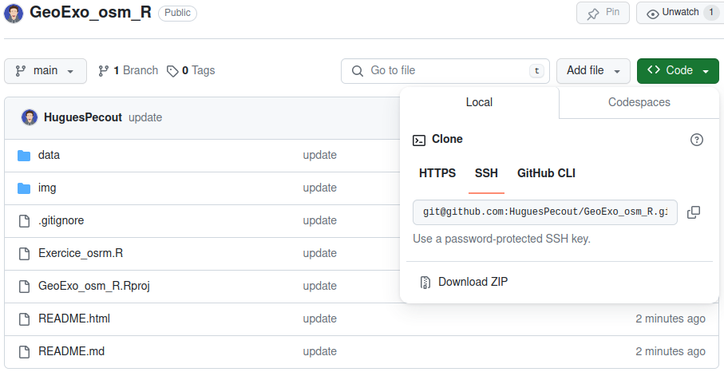
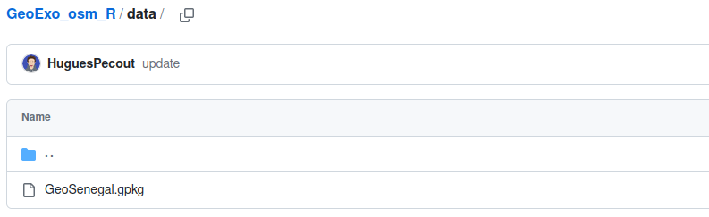
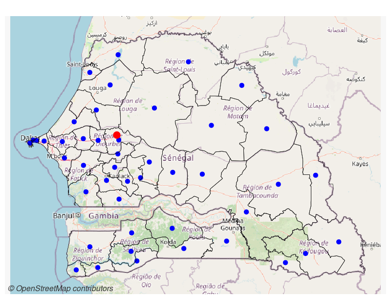

# OpenStreetMap avec R - Exercice appliqué 

### Master Géomatique - Université du Sine Saloum El-Hâdj Ibrahima NIASS

*Hugues Pecout*

 

#### **A. Téléchargement de l’espace de travail**

Un projet Rstudio est téléchargeable à ce lien : [**https://github.com/HuguesPecout/GeoExo_osm_R**](https://github.com/HuguesPecout/GeoExo_osm_R)

Téléchargez le dépot zipper ("*Download ZIP*") **GeoExo_osm_R** sur votre machine.   

 

Une fois le dossier dézipper, lancez le projet Rstudio en double-cliquant sur le fichier **GeoExo_sosm_R.Rproj**.

 

#### **B. Les données à disposition**

Les fichier de données sont mis à disposition dans le répertoire **data**, qui contient un seul fichier de données.

**Le fichier GeoPackage** (**GeoSenegal.gpkg**) contient 7 couches géographiques :

- **Pays_voisins** : Couche des frontières du Sénégal et de l'ensemble de ses pays limitrophes. Source : https://gadm.org/, 2014   
- **Senegal** : Couche des frontières du Sénégal. Source : https://gadm.org/, 2014   
- **Regions** : Couche des régions sénégalaises. Source : https://gadm.org/, 2014   
- **Departements** : Couche des Departements sénégalais. Source : https://gadm.org/, 2014   
- **Localites** : Couche de points des localités sénagalaises. Source : Base de données géospatiales prioritaires du Sénégal. https://www.geosenegal.gouv.sn/, 2014. 
- **USSEIN** : Localisation de l'Université du Sine Saloum El-hâdj ibrahima NIASS. Source : Google Maps, 2014. 
- **Routes** : Couche du réseau routier sénégalais. Source : Base de données géospatiales prioritaires du Sénégal. https://www.geosenegal.gouv.sn/, 2014. 

 

## **EXERCICE**

#### **En vous appuyant sur les manuels [Geomatique avec R](https://rcarto.github.io/geomatique_avec_r/) et [Cartographie avec R](https://rcarto.github.io/cartographie_avec_r/), effectuez les opérations suivantes dans le fichier Exercice_osrm.R :**

 

#### A. Import des données

Importez l'ensemble des couches géographiques contenues dans le fichier GeoPackage **GeoSenegal.gpkg**.

    st_layers("data/GeoSenegal.gpkg")

    ... <- st_read(dsn = "data/GeoSenegal.gpkg", layer = "...")

 

#### B. Géocadage d'une adresse (point de départ)

##### B.1 Récupération de coordonnées géographiques

Récupérer les coordonnées de l'adresse suivante : "Grande Mosquée de Touba, Sénégal" avec la fonction `geocode` du package `tidygeocoder`.

    ... <- data.frame(name = "...",
                      addresse = "Grande Mosquée de Touba, Sénégal")

    library(tidygeocoder)
    ... <- geocode(.tbl = ..., address =  addresse)

 

##### B.2 Construisez un objet sf (couche géographique) à partir des coordonnées (WGS84) récupérées.

    ... <- st_as_sf(..., coords = c("long", "lat"), crs = 4326)
    
 
  
   
##### B.3 Transformez cette nouvelle couche géographique en projection WGS 84 / UTM zone 28N (32628)

    
    ... <- st_transform(... , crs = "EPSG:32628")

 

##### B.4 Affichez le point sur une carte interactive avec le package `mapview`.
      
    library(mapview)
    mapview(...)
    
    
Le point est-il correctement localisé ?

 

#### C. Calcul de centroïdes (point de d'arrivée)

Créez une couche de point en calculant les centroïdes de départements sénégalais.

    ... <- st_centroid(...)

 

#### D. Récupération de tuiles (fond de carte) OpenStreetMap

En utilisant la librarie `maptiles`, récupérez une tuile OSM pour l'emprise du Sénégal.
Utilisez un buffer de plusieurs kilomètre autour des limites du sénégal pour une bonne couverture du territoire étudié.

    library(maptiles)
    ... <- get_tiles(x = st_buffer(x = ..., dist = ...), zoom = 8, crop = TRUE)

 

#### E. Affichage des données construites et récupérées

Affichez les couches géographiques suivantes dans la fenêtre graphique :

- La tuile OSM 
- Les limites des départements
- Les centroïdes des départements
- Le point géocodé

    
    plot_tiles(...)     
    mf_map(... , add = TRUE)    
    mf_map(... , add = TRUE)    
    mf_map(... , add = TRUE)    

 

#### F. Calculez des matrices de distances

##### F.1 Distance euclidienne

Calculez une matrice de distance euclidienne (m) entre la grande Mosquée de Touba et l'ensemble des centroïdes des départements.

    mat_eucli_km <- st_distance(x = ..., y = ...) 

    # Changement nom de ligne et de colonne de la matrice
    rownames(mat_eucli_km) <- ...$name
    colnames(mat_eucli_km) <- ...$NAME_2
    
    
 

##### F.2 Distance par la route (réseau routier d'OpenStreetMap)

En utilisant la fonction `osrmTable` du package `osrm`, calculez une matrice de distance en mètres et une matrice de distance temps (minutes).

    library(osrm)
    mat_route_km <- osrmTable(src = ..., 
                              dst = ...,
                              measure = c("distance", "duration"))
                              

  
                              
 ##### F.3 Ajouter les différentes distances calculées à la couche géographiques des centroïdes des départements
 
 Profitez-en pour convertir convertir les unités de mesur en kilomètre et en heure.
 
 
      # Distance Euclidienne - mètres -> kilomètres
      dep_pt$...t <- as.numeric(mat_eucli_km) / 1000
      
      # Distance par la route mètres -> kilomètres
      dep_pt$... <- as.numeric(mat_route_km$distances) / 1000
      
      # Distance temps par la route - minutes -> heures
      dep_pt$... <- as.numeric(mat_route_km$durations) / 60
      
 
 

#### G. Calculez d'indicateurs 

##### G.1 Calcul d'indicateurs globaux d'accessibilité

Calculez la médianne et la moyenne pour les trois type de distance récupérée (euclidienne, par la route, temps par la route).

    mean(...$...)
    max(...$...)

 

##### G.1 Calcul d'indicateurs de performance routière

 

